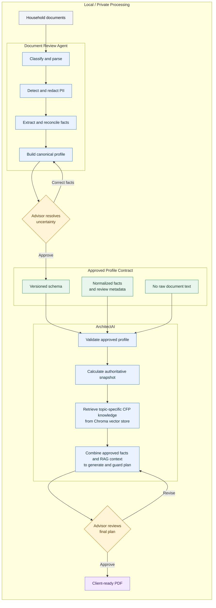
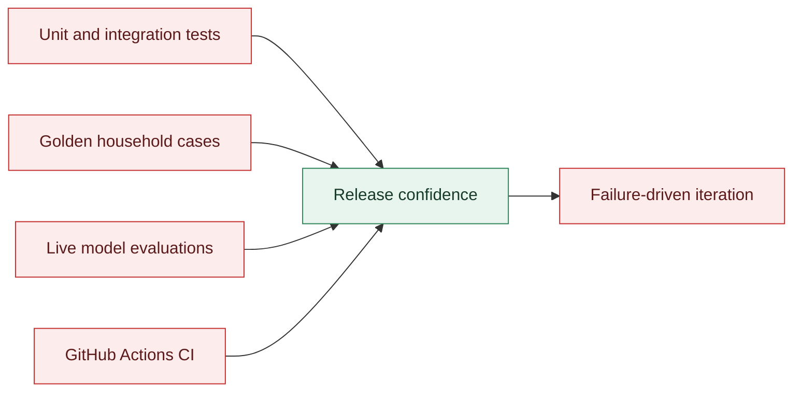

# Advisor Intelligence Workflow - System Architecture

**From client documents to an advisor-approved financial plan**

## Recruiter View

```mermaid
flowchart LR
    A["Household financial documents"] --> B["Document Review Agent"]
    B --> C["Canonical household profile"]
    C --> D{"Advisor review<br/>and resolution"}
    D -->|Approved| E["Versioned profile handoff"]
    E --> F["ArchitectAI"]
    F --> G["Grounded financial plan"]
    G --> H{"Advisor final review"}
    H --> I["Client-ready PDF"]

    D -->|Needs correction| B
    H -->|Needs revision| F

    classDef source fill:#F2F4F7,stroke:#667085,color:#101828;
    classDef system fill:#EAF2FF,stroke:#2E6FBB,color:#102A43;
    classDef human fill:#FFF4D6,stroke:#B7791F,color:#5F370E;
    classDef contract fill:#E8F5EE,stroke:#2F855A,color:#183B2A;
    classDef output fill:#F3E8FF,stroke:#805AD5,color:#3C1E70;

    class A source;
    class B,F system;
    class C,E contract;
    class D,H human;
    class G,I output;
```

## System Architecture

## Quality and Evaluation Layer

## Trust and Privacy Boundaries

### Raw Documents

- Source files are processed locally and are not stored in the canonical profile.
- PII detection combines Microsoft Presidio with financial-document-specific rules.
- Protected values are redacted before local LLM extraction.
- Real filenames are replaced by sanitized references such as `source_001.pdf`.

### Canonical Profile

- The handoff contains structured facts, metadata, planning gaps, and source references.
- It explicitly communicates whether protected PII was detected and whether cloud processing is allowed.
- It excludes raw document text and does not create sanitized copies of the original files.
- The schema is versioned so downstream applications can reject incompatible or incomplete profiles.

### Plan Generation

- ArchitectAI accepts the approved profile rather than the original documents.
- Profiles containing protected PII remain on the local model path.
- Internal evidence and source identifiers support validation but are omitted from the client-facing plan.
- Client-facing names and final delivery remain under advisor control.

## Decision Ownership

| Decision | Owner | Why |
|---|---|---|
| Document classification | Automated, reviewable | Efficient routing with recoverable failure |
| PII detection and redaction | Automated policy | Consistent enforcement before model processing |
| Fact extraction | Local LLM plus schema validation | Handles varied language while constraining output |
| Deposit classification | Human | A transaction amount alone does not establish income |
| Asset overlap resolution | Human | Requires understanding how statements and totals relate |
| Core financial totals | Deterministic application logic | Arithmetic should not depend on language-model judgment |
| Planning narrative | Local LLM | Converts approved facts and planning knowledge into useful prose |
| Regulatory and factual language | Automated guardrails plus advisor review | Reduces unsupported or outdated claims |
| Profile approval | Human | Material facts must be accepted before planning |
| Final-plan approval | Human | Professional judgment remains accountable for delivery |

## Probabilistic Versus Deterministic Work

### Language Models Handle

- Interpreting varied document language
- Mapping facts into structured schemas
- Summarizing source documents
- Drafting plan explanations and recommendations
- Translating technical planning concepts into client-facing language

### Application Logic Handles

- Schema validation
- PII policy enforcement
- Cloud-processing decisions
- Numeric normalization
- Asset, liability, cash-flow, and net-worth calculations
- Approval-state enforcement
- Evidence-reference validation
- PDF assembly and pagination

### Humans Handle

- Ambiguity the source documents cannot resolve
- Conflicting or overlapping account information
- Planning assumptions and corrections
- Acceptance of material gaps and risks
- Final professional judgment

## Component Responsibilities

### Document Review Agent

- Convert unstructured documents into structured, reviewable household facts
- Protect PII and communicate processing restrictions
- Surface uncertainty instead of silently filling gaps
- Produce a reusable canonical profile

### Shared Profile Contract

- Decouple document intelligence from downstream planning
- Normalize facts into a machine-readable format
- Preserve provenance, confidence, and review status
- Prevent raw source documents from directly controlling recommendations

### ArchitectAI

- Convert approved household facts into a stable planning snapshot
- Keep client facts separate from planning knowledge
- Retrieve topic-specific planning context from the CFP knowledge base
- Generate plan sections from approved facts plus RAG context
- Apply product-level quality controls before PDF delivery

## Architecture Principle

> The language model interprets and communicates. The application validates and
> calculates. The advisor resolves uncertainty and approves the result.
