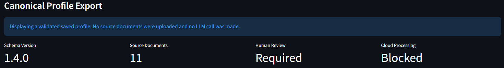
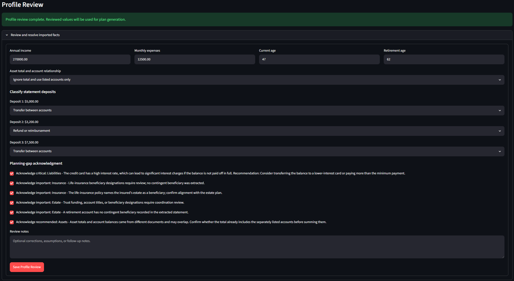
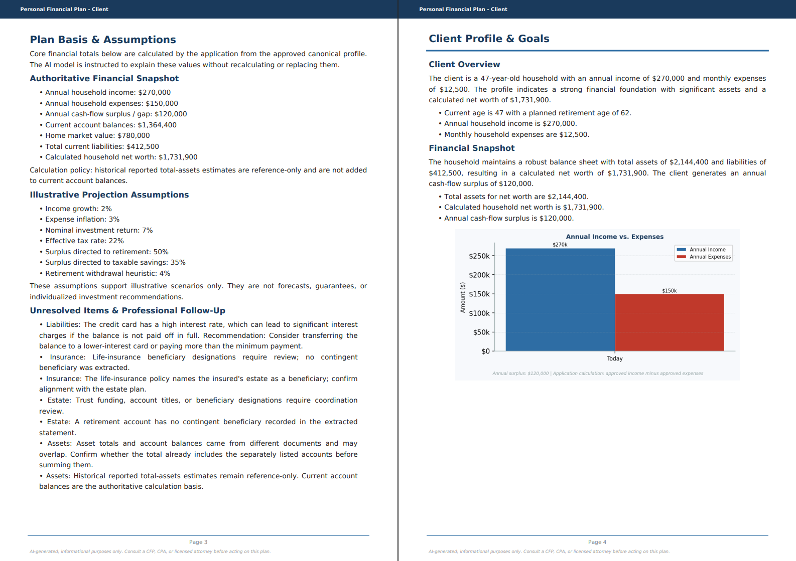
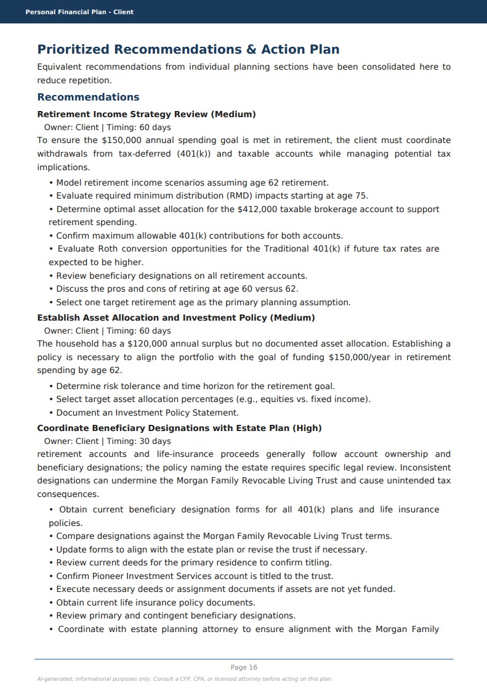

# Advisor Intelligence Workflow - Case Study

**From client documents to an advisor-approved financial plan**

## Executive Summary

Financial planning depends on accurate household information, yet the facts
required to build a plan are often scattered across statements, insurance
policies, estate documents, debt records, and client-provided planning
materials. Advisors and paraplanners must interpret those documents, reconcile
overlapping values, identify missing information, and manually convert the
results into planning-ready data before meaningful analysis can begin.

I designed and built **Advisor Intelligence Workflow** to explore how AI could
reduce that preparation burden without removing professional judgment. The
system connects two applications:

- **Document Review Agent** classifies financial documents, detects and redacts
  PII, extracts structured facts, reconciles information across documents, and
  produces a versioned canonical household profile.
- **ArchitectAI** accepts only the reviewed profile, freezes an authoritative
  financial snapshot, retrieves relevant CFP and financial-planning knowledge,
  applies deterministic calculations and planning guardrails, and uses a local
  language model to generate an advisor-reviewable financial plan and PDF.

The central product decision was to place a human approval layer between
document extraction and plan generation. Ambiguous deposits, overlapping asset
totals, missing beneficiary information, and other material uncertainties are
surfaced for resolution rather than silently converted into advice. Language
models interpret varied documents and draft explanations; application logic
enforces schemas, privacy policy, calculations, and approval state; the advisor
remains accountable for the final result.

The prototype demonstrates an end-to-end AI product workflow rather than an
isolated model feature. It includes a shared schema contract, local-first PII
controls, structured human review, golden household evaluations, automated
tests and CI, failure-driven iteration, grounded generation, and client-facing
output validation.

This case study demonstrates my ability to translate a complex professional
workflow into product requirements, make explicit decisions about model and
human responsibility, connect multiple AI systems through structured data,
evaluate failure modes, and carry a product from problem definition through a
working integrated experience.

## The Problem

Financial plans depend on accurate household information, but that information
rarely arrives in one clean data set. It is distributed across statements,
policies, estate documents, debt records, questionnaires, and planning notes.

Before planning begins, advisors and paraplanners must identify relevant facts,
resolve duplicate or conflicting values, distinguish income from account
transfers, identify missing information, and enter the approved data into
planning systems. This discovery and reconciliation work is necessary, but it
is repetitive and difficult to scale.

## Target User and Workflow

The primary users are financial advisors, planners, paraplanners, and planning
operations teams serving households with complex financial lives.

Advisor Intelligence Workflow is designed to support, rather than replace,
professional judgment. It moves a case through four controlled stages:

1. Extract structured facts from heterogeneous documents
2. Reconcile those facts into a canonical household profile
3. Require human resolution of material uncertainty
4. Generate a grounded plan from the approved profile

## Market Opportunity

Established platforms such as eMoney and MoneyGuide provide sophisticated
planning, account aggregation, portals, and modeling. Specialized AI products
such as FP Alpha and Holistiplan analyze tax, estate, insurance, and legal
documents.

This prototype explores the connective layer between those capabilities:
turning a broad collection of household documents into one normalized,
reviewable, and versioned data contract before that information drives a
financial plan.

The product is not positioned as a replacement for commercial planning
software. Its potential value is reducing manual discovery and reconciliation,
surfacing data problems earlier, and making approved household facts reusable
across downstream planning systems.

## Product Strategy

### Product Thesis

The product thesis was not that a language model should autonomously create a
financial plan from uploaded files. That approach would combine uncertain
document interpretation, financial calculations, planning judgment, and
client-facing communication inside one opaque generation step.

Instead, I designed the workflow around a reusable intermediate product: the
**canonical household profile**. This structured profile separates document
interpretation from downstream planning and creates a point where facts can be
reviewed, corrected, approved, and reused.

The resulting product strategy follows five principles:

1. **Structure before advice.** Convert source documents into a consistent
   household data model before generating recommendations.
2. **Surface uncertainty.** Missing, conflicting, or ambiguous information
   should create a review task rather than a silent assumption.
3. **Separate responsibilities.** Use language models for interpretation and
   communication, deterministic code for calculations and policy enforcement,
   and humans for material judgment.
4. **Protect the system boundary.** Raw documents and PII should not move
   between applications when a smaller structured artifact is sufficient.
5. **Separate client facts from professional knowledge.** Approved household
   facts and retrieved financial-planning material serve different purposes
   and should not be mixed into one ungoverned data store.
6. **Remain model-agnostic.** The product should be able to benchmark and
   replace models without redesigning the workflow.

### Product Scope

The prototype focuses on the complete discovery-to-draft workflow:

- Ingest heterogeneous financial and planning documents
- Extract and normalize household facts
- Detect PII, conflicts, uncertainty, risks, and missing information
- Build a canonical profile with source and review metadata
- Require resolution of material planning questions
- Create an approved, versioned profile handoff
- Retrieve relevant planning knowledge for each requested plan section
- Generate a grounded financial-plan draft
- Validate and format the result for advisor review

The scope deliberately does not include autonomous delivery of financial
advice, account implementation, trading, client authentication, or
enterprise-grade records management.

### Initial Product User

The primary user is a financial advisor or paraplanner preparing a
comprehensive planning case. The system is designed to reduce repetitive
preparation while allowing that professional to:

- See what the system extracted
- Understand what remains uncertain
- Correct or supplement material facts
- Control which assumptions drive the plan
- Review the generated recommendations before client delivery

### Success Definition

For the prototype, success means demonstrating that a complex fictional
household can move through the complete workflow with:

- Protected PII handled according to explicit policy
- Important facts represented in a shared schema
- Ambiguities surfaced for human resolution
- Core totals calculated consistently
- Unsupported statements filtered from the plan
- A final PDF grounded in the approved household profile

This is evidence of workflow viability, not a claim of production-grade
extraction accuracy or measured commercial time savings.

## System Design

The system is divided into two applications connected by a versioned profile
contract.

**Document Review Agent** owns the uncertain source-document stage. It parses
and classifies files, detects and redacts PII, routes documents to structured
extraction schemas, reconciles information across sources, and builds the
canonical profile.

**ArchitectAI** owns the approved planning stage. It validates the imported
profile, applies human resolutions, freezes an authoritative household
snapshot, calculates core financial totals, retrieves relevant planning
knowledge, generates plan sections, applies guardrails, and assembles the PDF.

ArchitectAI uses two distinct grounding inputs:

1. **Approved client facts** come from the canonical profile and authoritative
   financial snapshot.
2. **Planning knowledge** comes from a retrieval-augmented generation layer
   built from CFP and financial-planning materials.

The knowledge pipeline loads PDF, DOCX, and text sources; preserves source,
page, and category metadata; splits the material into overlapping chunks;
creates local `all-MiniLM-L6-v2` embeddings; and stores the vectors in Chroma.
For each requested CFP topic, ArchitectAI retrieves a small set of semantically
relevant knowledge chunks and supplies them to the section-generation prompt.

This separation matters. Household facts answer **what is true about this
client**. Retrieval answers **what planning concepts may be relevant to those
facts**. The language model is asked to combine the two, but it is not allowed
to replace approved client facts with statements from the knowledge base or
recalculate the authoritative snapshot.

The shared contract prevents either application from depending on the other's
internal implementation. It also establishes a narrow trust boundary: the
planning application receives approved structured facts rather than raw client
documents.

## Key Product Decisions

### 1. Create a Canonical Profile Instead of Sending Documents Directly

**Decision:** Introduce a normalized household profile between extraction and
planning.

**Why:** Raw documents are inconsistent, duplicative, privacy-sensitive, and
difficult for downstream systems to interpret reliably. A shared profile
creates one reviewable source of truth and can eventually support destinations
beyond ArchitectAI.

**Tradeoff:** The schema requires ongoing governance and must evolve without
breaking downstream consumers.

### 2. Require Human Approval Before Plan Generation

**Decision:** Block the approved-profile handoff until material review items
are resolved or acknowledged.

**Why:** Some questions cannot be answered from extraction alone. A deposit may
be income, a transfer, or a reimbursement. A reported asset total may already
include separately listed accounts. Automating those judgments would create
false precision.

**Tradeoff:** Human review prevents a fully automatic workflow, but produces a
more credible and professionally accountable product.

### 3. Keep PII Processing Local by Default

**Decision:** Detect and redact PII locally and block cloud processing when
protected categories remain.

**Why:** The source material can contain names, addresses, account numbers,
Social Security numbers, and other sensitive financial information. Local
processing reduces unnecessary exposure and creates a stronger default for
privacy-conscious firms.

**Tradeoff:** Local models can require more hardware, take longer, and produce
weaker prose than frontier cloud models. The architecture preserves the option
to add a separately approved, de-identified cloud path later.

### 4. Separate Model Work from Deterministic Logic

**Decision:** Use models to interpret varied language and draft narrative, but
use application code for validation, normalization, approval enforcement, and
financial calculations.

**Why:** Asset totals, liabilities, cash flow, and net worth should not change
because a language model reasons differently on another run. Deterministic
logic makes those values reproducible and testable.

**Tradeoff:** More behavior must be explicitly modeled in code rather than
delegated to a flexible prompt.

### 5. Freeze an Authoritative Snapshot

**Decision:** ArchitectAI creates one approved set of core figures before plan
generation.

**Why:** The household may contain a reported asset total, separately listed
accounts, real estate, and liabilities from different documents. Freezing the
resolved snapshot prevents the model from independently recomputing totals or
mixing incompatible values across plan sections.

**Tradeoff:** Corrections require returning to the review layer and
regenerating the approved artifact.

### 6. Preserve Evidence Internally Without Exposing It in the Plan

**Decision:** Retain source and evidence identifiers for validation while
removing them from client-facing prose.

**Why:** Internal traceability helps test whether claims are grounded, but file
references and evidence IDs make the financial plan harder for a client to
read and can expose implementation details.

**Tradeoff:** The advisor-facing product may eventually need a separate
evidence view rather than relying on the client PDF.

### 7. Design for Model Replacement

**Decision:** Route generation through configurable model interfaces and keep
the shared schema independent of a specific provider.

**Why:** Model quality, cost, latency, privacy, and hardware requirements
change quickly. The product should be evaluated as a complete system rather
than depend on permanent access to one model.

**Tradeoff:** Prompts and validation still require regression testing whenever
the model changes.

### 8. Separate Client Facts from the RAG Knowledge Base

**Decision:** Pass approved household facts directly from the canonical profile
while retrieving planning knowledge from a separate vector store.

**Why:** Embedding client facts alongside planning literature would blur
authority, complicate updates and deletion, and make it harder to determine
whether a plan statement came from the household record or general guidance.
Separate paths make the prompt easier to reason about and preserve the
canonical profile as the source of truth.

**Tradeoff:** The generation layer must reconcile two context types and prevent
general knowledge from overriding client-specific facts.

### 9. Retrieve Knowledge by Plan Topic

**Decision:** Run semantic retrieval separately for each requested CFP section
rather than sending the entire knowledge library to the model.

**Why:** Topic-specific retrieval reduces context size, improves relevance, and
allows local models to generate structured outputs more reliably. It also
supports different knowledge needs for retirement, tax, estate, investment,
insurance, and executive or entrepreneur planning sections.

**Tradeoff:** Retrieval quality becomes its own product dependency. Relevant
material can be missed, redundant chunks can be returned, and semantically
similar text is not necessarily current or authoritative.

### 10. Govern Sources and Gate Specialty Retrieval

**Decision:** Register planning sources by authority tier, approved use,
planning role, topic, review status, and review date. Exclude specialty sources
from ordinary retrieval and activate them only when approved structured client
facts contain sufficient evidence.

**Why:** A specialized planning text may be valuable for an executive or
business owner but inappropriate for an ordinary household. Routing from
generated recommendations would allow model prose to manufacture its own
retrieval justification. Routing from the approved career and business-owner
profile keeps the decision inspectable and deterministic.

**Tradeoff:** The profile schema and evaluation set must represent the facts
needed for routing, and specialty activation rules require regression tests.

### 11. Treat the Generated Plan as a Draft

**Decision:** Require advisor review before the final PDF is delivered.

**Why:** Guardrails can reduce unsupported claims but cannot transfer
professional accountability to the model. The advisor remains responsible for
the relevance, currentness, and suitability of the final recommendations.

**Tradeoff:** The product optimizes professional leverage rather than full
autonomy.

## Privacy, Safety, and Human Oversight

The product handles information that can expose identity, account ownership,
financial position, health-related insurance details, and estate-planning
relationships. Privacy and human oversight are therefore workflow
requirements, not disclaimers added after generation.

### Local-First Processing

Document Review Agent defaults to local processing. Microsoft Presidio provides
the base PII recognizers, while application-specific logic handles financial
patterns and exceptions such as:

- Social Security numbers
- Bank and account numbers
- Names, phone numbers, and email addresses
- Repeated PII occurrences
- Legal jurisdictions that should not be treated as personal addresses

Protected values are redacted before local LLM extraction. When configured for
cloud processing, the application blocks the request if protected PII remains.
The policy decision is returned explicitly rather than hidden inside model
routing.

### Data Minimization Between Applications

The handoff from Document Review Agent to ArchitectAI contains the smallest
artifact needed for planning:

- Structured and normalized facts
- Confidence and redaction metadata
- Planning gaps and review requirements
- Sanitized source references
- Cloud-processing and human-review decisions

It does not include raw document text, and filenames are replaced with
references such as `source_001.pdf`. These references identify the origin of a
fact without creating renamed copies of the underlying documents.

### Human Review Gates

The workflow assigns humans decisions that the source material or model cannot
resolve reliably:

- Whether statement deposits represent income, transfers, refunds, or other
  activity
- Whether aggregate asset values overlap with separately listed accounts
- Whether ages, goals, and assumptions are complete
- Whether insurance and estate-planning gaps have been understood
- Whether a profile is ready to become an approved planning input
- Whether the generated plan is appropriate for client delivery

ArchitectAI records the review resolution separately from the imported
canonical profile. This preserves the original DRA artifact and makes the
advisor's corrections and acknowledgments explicit.

### Safety Controls During Generation

Before generation, ArchitectAI:

- Rejects unsupported schema versions
- Rejects profiles that falsely claim sanitized source references
- Enforces cloud-processing restrictions
- Requires resolution of material review items
- Freezes an approved snapshot and resolution hash

During and after generation, it:

- Supplies the model with approved facts and topic-specific retrieved knowledge
- Prevents the model from recalculating authoritative totals
- Removes unsupported risk claims when the cited evidence is absent
- Qualifies legal, tax, regulatory, and investment language
- Filters invalid evidence references
- Removes internal filenames and evidence IDs from client-facing prose
- Consolidates recommendations to reduce contradictory or duplicated actions

These controls reduce risk but do not certify the advice. The final plan remains
an advisor-reviewed draft.

### Current Safety Boundary

The prototype does not yet provide enterprise authentication, role-based
access, encrypted storage, formal retention policies, immutable audit logs, or
compliance-approved records management. Those are requirements for commercial
deployment, not features implied by local execution.

## Evaluation and Iteration

The workflow was developed through layered evaluation rather than judging the
product only by whether the final plan sounded plausible.

### Evaluation Layers

1. **Document parsing and classification:** Can supported source files be read
   and routed to the correct extraction schema?
2. **PII detection and redaction:** Are protected values identified, removed
   from model inputs, and represented correctly in structured output?
3. **Structured extraction:** Does the model return schema-valid facts rather
   than free-form prose?
4. **Profile mapping and reconciliation:** Are facts placed in the correct
   household domains without double counting or unsupported inference?
5. **Shared-contract validation:** Can ArchitectAI reject incompatible,
   unsanitized, or incomplete profile artifacts?
6. **Human-resolution behavior:** Do advisor decisions change the planning view
   without mutating the source profile?
7. **Authoritative snapshot calculations:** Are income, expenses, assets,
   liabilities, cash flow, and net worth computed reproducibly?
8. **RAG and plan generation:** Does each section receive approved facts and
   relevant planning context without allowing retrieved material to override
   the household record?
9. **Knowledge governance:** Are retrieved sources registered, approved for
   the requested use, within their review window, and appropriately routed?
10. **Plan guardrails:** Are unsupported, outdated, absolute, or internally
   referenced statements removed or qualified?
11. **Presentation:** Does the final PDF remain readable, internally
    consistent, and free from implementation artifacts?

### Golden Household Evaluation

Golden cases provide fictional source documents, expected facts, expected
review decisions, and expected downstream planning inputs. The most complete
case, Golden Client 2, represents a married household with eleven documents
covering cash, retirement assets, brokerage assets, debt, insurance, estate
planning, income, expenses, goals, executive compensation, and business
ownership.

The automated golden handoff checks:

- Annual income and annualized expenses
- Cash, brokerage, and retirement balances
- Retirement age
- Preservation of the asset-overlap warning
- Deposit classification
- Prevention of transfer annualization
- Selected asset-overlap resolution
- Planning-gap severity
- Cloud-processing restrictions
- Sanitized source references
- Frozen approved-snapshot integrity
- Structured career and business-owner facts
- Fact-supported executive specialty retrieval

### Failure-Driven Iteration

The most valuable improvements came from inspecting failures rather than
showcasing only successful outputs:

- **Legal jurisdiction false positive:** California governing law was initially
  redacted as a personal location. Domain-specific PII logic was added so legal
  jurisdiction remains available while personal addresses stay protected.
- **Incomplete redaction:** Repeated names and grouped bank-account numbers
  survived early redaction. Detection patterns and tests were expanded to cover
  every occurrence.
- **Deposit treated as income:** A bank-statement deposit was initially mapped
  into income. Statement deposits were separated from verified income and
  require human classification.
- **Overlapping asset totals:** Summary assets and individually listed accounts
  could be added together. ArchitectAI now requires an explicit overlap
  resolution and freezes the resulting snapshot.
- **Unsupported risk statement:** The model described a credit-card balance as
  high-interest without an extracted rate. Risk flags now require supporting
  evidence.
- **PII placeholders in output:** Redaction tokens appeared inside account
  names and summaries. Structured redaction metadata and output sanitization
  replaced visible placeholders where appropriate.
- **Internal evidence leakage:** Source IDs and filenames appeared in the
  client plan. Evidence remains available internally but is removed from the
  client-facing PDF.
- **Outdated or overbroad planning language:** RMD and beneficiary statements
  exposed the risk of relying on model memory. Guardrails were added, and a
  versioned regulatory-knowledge layer was identified as future work.
- **Refund claimed by amount-less payroll evidence:** A generic payroll label
  consumed the next unmatched deposit and incorrectly classified a tax refund.
  Mixed-evidence statements now require exact amount matching.
- **Specialty retrieval activated by generated prose:** Executive-planning
  terms inside model recommendations could activate specialty material even
  when structured career facts were removed. Routing now inspects the approved
  career and business-owner domain only.

### RAG Evaluation Status

The retrieval layer now has an explicit governance registry and a small labeled
evaluation set. Each source records authority tier, approved uses, planning
role, topic coverage, review status, and review dates. Retrieval tests verify
expected-source group recall, precision at k, reciprocal rank, source
registration, governance status, authority requirements, and the absence of
current-versus-superseded conflicts.

The current relevance cases cover professional standards, evergreen retirement
planning, and executive concentrated-stock planning. All three pass with 100%
expected-source group recall, 100% precision at k, and a 1.0 mean reciprocal
rank.

The overall five-case evaluation remains intentionally incomplete. No
authoritative current regulatory sources are registered, so current RMD-age
and federal estate-tax exclusion questions fail governance checks instead of
using educational textbooks as current law. This is a known content-governance
gap and a successful safety behavior.

The next evaluation phase should expand the labeled set, add expert relevance
judgments across every plan topic, introduce authoritative current-rule
sources, and regression-test embedding, chunking, and retrieval changes.

### What the Results Establish

The tests and golden cases establish that the current prototype can enforce its
schema, privacy, approval, calculation, and core plan-generation contracts
across the evaluated scenarios. They do not establish production accuracy
across the diversity of real household documents, scanned PDFs, institutions,
jurisdictions, or changing regulatory rules.

## Demonstration Results

### Golden Client 2 Scenario

The flagship demonstration uses eleven fictional documents representing a
married household with:

- Two months of joint bank statements
- Two employer 401(k) statements
- A taxable brokerage statement
- A mortgage statement
- A credit-card statement
- Two life-insurance policies
- A revocable living trust
- Household income, expenses, goals, and planning assumptions
- A CFO role with restricted stock and deferred compensation
- A managing-partner role with a 20% business interest
- A \$75,000 personal guarantee

This case was designed to create realistic cross-document questions rather than
only test clean extraction. It includes overlapping asset information,
unclassified statement deposits, high-interest debt, beneficiary and estate
coordination issues, and facts distributed across multiple document types.
It also tests whether specialty executive and entrepreneur knowledge is
activated from structured client facts rather than from prompt keywords or
generated recommendations.

### Profile-Building Result

Document Review Agent processed the fictional document set into a versioned
canonical profile containing household, income, expense, asset, liability,
insurance, estate, goal, career and business-owner, recommendation, source,
confidence, and cloud-safety domains.

*The saved Golden Client 2 profile retains the same validation and safety
metadata as a newly generated export without rerunning the source documents or
calling an LLM.*

The workflow surfaced review items instead of resolving them silently. The
advisor review layer was used to:

- Ignore an overlapping reported asset total and use the listed accounts
- Classify three statement deposits as transfers or a refund rather than income
- Confirm current age and retirement age
- Acknowledge debt, beneficiary, estate-coordination, and asset-overlap gaps

*Material ambiguity is resolved explicitly before generation. The original DRA
profile remains unchanged while the advisor decisions are stored separately.*

*The completed profile is frozen with an approval ID and timestamp, creating a
traceable boundary between reviewed facts and downstream plan generation.*

After those decisions, ArchitectAI froze this authoritative snapshot:

| Planning fact | Approved result |
|---|---:|
| Annual household income | \$270,000 |
| Monthly household expenses | \$12,500 |
| Annual cash-flow surplus | \$120,000 |
| Listed financial accounts | \$1,364,400 |
| Home market value | \$780,000 |
| Total liabilities | \$412,500 |
| Home equity | \$382,000 |
| Calculated net worth | \$1,731,900 |

The approved values remained consistent across the planning context, charts,
recommendations, and final plan. Statement transfers were preserved as
transactions rather than annualized into household income.

### Plan-Generation Result

ArchitectAI combined the approved snapshot with topic-specific retrieved
planning context and generated a structured financial-plan draft. The final
workflow produced:

- A plan basis and assumptions section
- Client profile, goals, and financial snapshot
- Retirement and income planning
- Investment planning
- Tax-planning follow-up
- Estate-planning coordination
- Risk-management and insurance review
- Consolidated recommendations and action plan
- Illustrative charts
- A locally generated PDF
- Governed executive and entrepreneur specialty retrieval

*The advisor selects which planning domains to include rather than submitting
the household to a fixed, one-size-fits-all generation prompt.*

*Application-calculated income, expenses, assets, liabilities, cash flow, and
net worth remain visible as the authoritative basis for the generated plan.*

*Recommendations are consolidated into an advisor-reviewable action plan with
priority, ownership, timing, and concrete follow-up steps.*

The final acceptance review confirmed that:

- Approved asset and net-worth values remained consistent
- The model did not independently recalculate authoritative totals
- Statement deposits were not presented as recurring income
- Unsupported evidence IDs and source filenames were absent from client prose
- Internal evidence catalogs were omitted from the client PDF
- RMD language reflected the applicable age used by the guardrail
- Overbroad beneficiary, tax, and investment claims were qualified or removed
- Recommendations were consolidated rather than repeated throughout sections
- The PDF rendered as a readable 17-page planning document

### Automated Acceptance Evidence

Automated Golden Client 2 benchmarks validate both the frozen DRA canonical
profile and the ArchitectAI approval handoff. Their latest runs passed all
defined fact or planning-input, semantic, and safety checks, including:

- Correct income, expense, cash, brokerage, and retirement values
- Correct liabilities, home equity, and calculated net worth
- Transfer classification without income annualization
- Preservation of the asset-overlap warning
- Required acknowledgment of material planning gaps
- Cloud-processing restrictions
- Sanitized source references
- Detection of deliberate asset, PII, net-worth, and cloud-safety regressions
- Preservation of executive-compensation and business-owner facts
- Activation of specialty retrieval from approved structured facts

The deterministic benchmark begins with the frozen canonical profile so it can
run quickly and consistently in automated tests. The complete eleven-document
extraction flow has also been exercised locally, but its live-model output is
evaluated separately because generation can vary by model and runtime.

The current DRA and ArchitectAI Golden Client 2 reports use benchmark version
`2.1.0` and profile schema `1.4.0`; both score 100% across their defined
categories. The current automated suites contain 149 passing DRA tests and 62
passing ArchitectAI tests.

### Demonstrated Outcome

The prototype demonstrates that a complex household can move from a mixed
document set to an approved structured profile and then to a grounded,
advisor-reviewable plan without allowing raw documents or unresolved
assumptions to directly drive recommendations.

It does not yet quantify advisor time savings, extraction accuracy across a
large corpus, or client outcomes.

## Limitations

### Evaluation Breadth

The current golden cases cover important failure modes but not the diversity of
real planning work. More evaluation is needed across:

- Single clients, married households, trusts, businesses, and multigenerational
  families
- Accumulation, retirement-income, estate, insurance, and concentrated-stock
  cases
- Different institutions and statement formats
- Conflicting documents from different dates
- Low-quality scans, handwriting, tables, and OCR failures
- Missing pages and partially available records

### Extraction Accuracy

The system has strong regression tests for discovered failures, but it does
not yet have a large labeled corpus with field-level precision, recall, and
confidence calibration. A valid schema does not guarantee that every extracted
value is correct.

### Retrieval Quality and Knowledge Freshness

ArchitectAI now has a source-governance registry and an initial retrieval
benchmark, but the labeled set and authority coverage remain limited. The
knowledge base may still contain:

- Stale tax or retirement rules
- Duplicate or conflicting sources
- General guidance that does not apply to a specific jurisdiction
- Relevant material that semantic retrieval fails to return

Time-sensitive rules should not depend on the model's memory or an undated
knowledge chunk. The current benchmark correctly fails current-rule cases
because approved authoritative regulatory sources have not yet been added.

### Planning Depth

The generated plan is a structured planning draft, not a replacement for a
commercial calculation engine. Current projections are illustrative and do not
provide the full tax, probability, Monte Carlo, Social Security, pension,
estate-tax, or portfolio-optimization capabilities of mature planning
platforms.

### User Experience

The current workflow proves the major decisions but remains prototype-oriented.
Review items can be dense, the two applications require separate startup and
handoff steps, and the advisor-facing evidence experience is less developed
than the client PDF.

### Operational Readiness

The applications do not yet provide:

- Enterprise authentication and role-based permissions
- Encryption and managed secret storage
- Tenant isolation
- Formal retention and deletion policies
- Immutable audit logs
- Backup and recovery
- Monitoring, service-level objectives, or incident response
- Compliance-approved books and records
- CRM, custodian, or commercial planning-platform integrations

### Business Validation

The problem and workflow are grounded in professional planning practice, but
the prototype has not yet been piloted across multiple firms or measured
against baseline preparation time, correction rates, advisor satisfaction, or
planning capacity.

## Roadmap

### 1. Broaden Evaluation Before Adding More Generation Features

- Add a scored live-extraction run for all eleven Golden Client 2 documents
- Add varied household archetypes and adversarial document combinations
- Build a labeled extraction set with field-level accuracy metrics
- Add OCR and scanned-PDF test cases
- Compare local models against the same frozen evaluation set

### 2. Expand RAG Evaluation and Source Coverage

- Expand the labeled planning question-to-source retrieval benchmark
- Add expert relevance judgments by CFP topic
- Detect duplicate, conflicting, and low-authority sources
- Add authoritative current-rule sources with version, jurisdiction, effective
  date, and review metadata
- Regression-test chunking, embedding, and retrieval changes

### 3. Build a Versioned Regulatory Rules Layer

Separate time-sensitive rules from general planning literature:

1. Evergreen CFP principles and educational material
2. Structured rules for RMD ages, contribution limits, tax brackets, estate
   exclusions, Social Security thresholds, and Medicare thresholds
3. Jurisdiction-specific tax, trust, estate, and probate material

Application code should determine rule eligibility and calculations. The model
should explain the supplied result rather than recall the rule. CI should flag
expired or overdue regulatory records.

### 4. Improve Advisor Review and Provenance

- Add page-level evidence views for material facts
- Make conflicts, confidence, and document dates easier to compare
- Support approve, correct, defer, and request-document workflows
- Preserve a clear change history between imported, resolved, and approved
  profiles
- Add a single integrated case workspace across both applications

### 5. Add Production Data and Security Controls

- Authentication, role-based permissions, and tenant isolation
- Encryption in transit and at rest
- Configurable retention and deletion
- Audit events for extraction, correction, approval, and generation
- Operational monitoring and recoverability

### 6. Integrate with the Existing Advisor Technology Stack

- CRM and client-portal intake
- Custodian and account-aggregation data
- eMoney, MoneyGuide, or other planning-system exports
- Document-management and compliance archives
- API-based approved-profile handoff

### 7. Validate Commercial Value

- Pilot with a small set of planning professionals
- Measure preparation time, correction frequency, and unresolved-data rates
- Compare advisor confidence with and without the review layer
- Identify the narrowest initial workflow with a credible willingness to pay

Cloud-model plan generation remains optional rather than a near-term priority.
The architecture should preserve the path, but local-model quality, privacy,
evaluation, and workflow integration currently provide greater product value.

## My Role

I conceived, scoped, designed, and implemented the workflow as an independent
product builder.

### Product Leadership

- Identified the discovery-to-planning workflow as the product opportunity
- Defined target users, scope, product principles, and human-approval points
- Prioritized the canonical profile as the intermediate product
- Made privacy, model-routing, evidence, and calculation tradeoffs
- Designed the staged roadmap from prototype validation toward commercial use

### Technical Product Design

- Designed the boundary between Document Review Agent and ArchitectAI
- Defined and versioned the canonical-profile contract
- Separated client facts, retrieved planning knowledge, deterministic
  calculations, and model-generated narrative
- Designed local/cloud processing policy and approved-profile enforcement
- Defined the authoritative snapshot and review-resolution workflow

### Hands-On Implementation

- Built the Python, FastAPI, Streamlit, Pydantic, Ollama, Presidio, Chroma, and
  PDF-generation workflows
- Implemented structured extraction, profile mapping, approval artifacts, RAG,
  plan generation, validation, and client-facing output
- Created fictional documents and golden household scenarios
- Added automated tests, CI, scripts, and evaluation reports

### Evaluation and Iteration

- Tested the system end to end with contracts, planning documents, fictional
  statements, and a real bank statement processed locally
- Investigated failures rather than accepting plausible model output
- Converted observed failures into product rules, schemas, guardrails, and
  regression tests
- Reviewed generated plans for factual consistency, unsupported claims,
  internal evidence leakage, regulatory language, and PDF quality

This was not a production deployment or a cross-functional company project. It
was an independently built product prototype intended to demonstrate how I
approach AI product strategy, technical architecture, evaluation, safety, and
execution.
